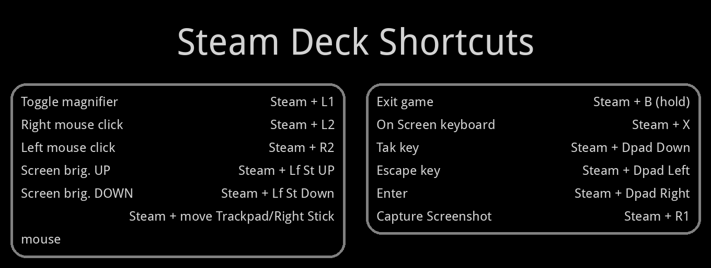
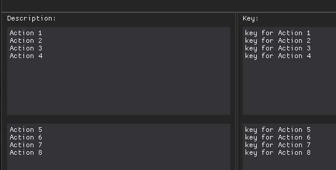

# KEY SHORTCUT CHEAT-SHEET GENERATOR
#### Video Demo:  <URL HERE>
### Description:
A script to generate cheat sheets with keybinds.

Easy and fast way to create an image that lists an action and associated keybind. 
Useful for learning shortcuts to new software, complex game shortcuts, having printed out shortcuts
for software you rarely use (color scheme made for printing).
It can also be used for just about any text (up to a reasonable point)

## Examples

### IDE Shortcuts - PyCharm Community Edition
<picture></picture>

### Board Game cheat sheet for print - Ticket to Ride: Europe

<picture></picture>

### Device keymap for OLED screen - Steam Deck

<picture></picture>

## Usage

To create a new keymap description, you need to modify default list in GUI. 
Every action should have a matching key, so the lines are kept
in aligment (You can just use ENTER key to accomplish that and have empty line). 
You can add more elements to the list, which will result in creating another
panel (see PyCharm keymap example)
Also if You delete all contents of a cell, then that panel won't be created. (Click inside a cell, Ctrl-A to select all then hit Delete to do so)

Following input:

<picture></picture>

will result in showing following table:

<picture></picture>

If the Action and Key description overlap each other you are able to increase the spacing between them with 
***default_width_of_panel*** parameter value.

### Color schemes

There are 6 color schemes included, so there should be something for you if you 
are dark or light theme user, have an OLED display or want something fancy. 
You can also create your own, so it matches your themes in your other software.
Select them from the dropdown list. 

> [!IMPORTANT] 
> Make sure you use font that your Python runtime has access to.

Dependencies (also listed inside requirements.txt):
- sys
- pillow
- dearpygui

Tested on Python 3.11 and 3.12

## What did I learn?
Besides increasing my Python coding skills a little bit, I learned GUI framework which is very powerful and will propably help me with my next Python projects.

But bigger lesson is that architecture should be a big consideration while coming up with a program. Lesson learned too late, which results in little test coverage and poor structure. Instance of class is pretty much used as container for global variables and functions have small or no interfaces, but a lot of side effects.   

### Ideas for next changes

- [x] move configuration to separate file (JSON or xml)
  - [x] Moved to other .py file and there is a class that contains the configuration
- [ ] move action and key list to separate file (csv?)
  - [x] Moved to other .py file and there is a class that contains the configuration
- [ ] more error handling
- [x] GUI
- [ ] refactor for testability

### checklist
- [x] main and 3 functions
- [x] tests for 3 functions
- [x] Your main function must be in a file called project.py, which should be in the “root” (i.e., top-level folder) of your project.
- [x] Your 3 required custom functions other than main must also be in project.py and defined at the same indentation level as main
- [x] Your test functions must be in a file called test_project.py, which should also be in the “root” of your project.
- [x] Any pip-installable libraries that your project requires must be listed, one per line, in a file called requirements.txt in the root of your project.
- [x] What will your software do? What features will it have? How will it be executed?
- [x] What new skills will you need to acquire? What topics will you need to research?
- [x] Color schemes - OLED/GRUBBOX/ROSEPINE/PRINT/WHITE THEME/DARK THEME