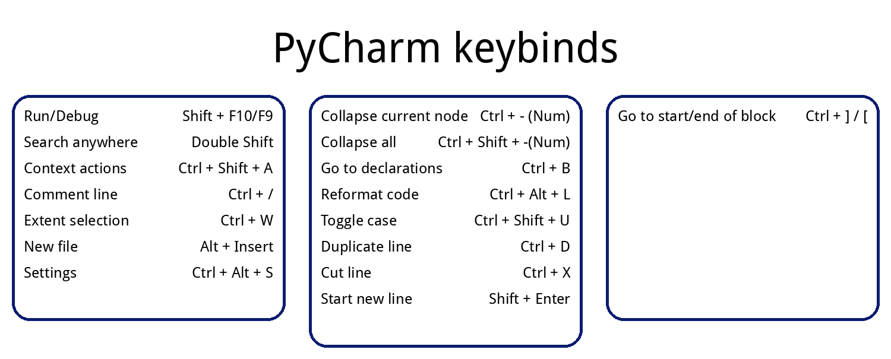

# KEY SHORTCUT CHEAT-SHEET GENERATOR

### Description:
A script to generate cheat sheets with keybinds.

Easy and fast way to create an image that lists an action and associated keybind. 
Useful for learning shortcuts to new software, complex game shortcuts, having printed out shortcuts
for software you rarely use (color scheme made for printing).
It can also be used for just about any text (up to a reasonable point)

## Examples

### IDE Shortcuts - PyCharm Community Edition
<picture></picture>

### Board Game cheat sheet for print - Ticket to Ride: Europe

<picture></picture>

### Device keymap for OLED screen - Steam Deck

<picture></picture>

## Usage

To create a new keymap description, you need to modify default list in GUI. 
Every action should have a matching key, so the lines are kept
in aligment (You can just use ENTER key to accomplish that and have empty line). 
You can add more elements to the list, which will result in creating another
panel (see PyCharm keymap example)
Also if You delete all contents of a cell, then that panel won't be created. (Click inside a cell, Ctrl-A to select all then hit Delete to do so)

Following input:

<picture></picture>

will result in showing following table:

<picture></picture>

If the Action and Key description overlap each other you are able to increase the spacing between them with 
***default_width_of_panel*** parameter value.

### Color schemes

There are 6 color schemes included, so there should be something for you if you 
are dark or light theme user, have an OLED display or want something fancy. 
You can also create your own, so it matches your themes in your other software.
Select them from the dropdown list. 

> [!IMPORTANT] 
> Make sure you use font that your Python runtime has access to.

Dependencies (also listed inside requirements.txt):
- sys
- pillow
- dearpygui

Tested on Python 3.11 and 3.12

### Ideas for next changes

- [x] move configuration to separate file (JSON or xml)
  - [x] Moved to other .py file and there is a class that contains the configuration
- [ ] move action and key list to separate file (csv?)
  - [x] Moved to other .py file and there is a class that contains the configuration
- [ ] more error handling
- [x] GUI
- [ ] refactor for testability
